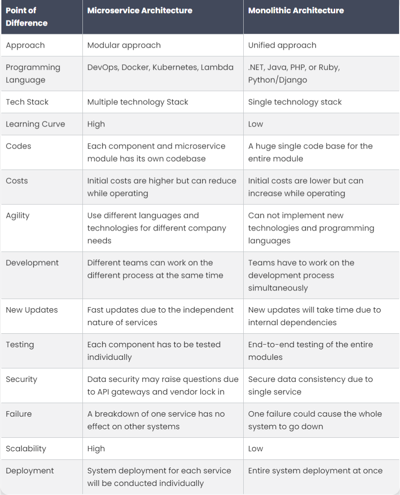

# _Chapter 06 - Exploring The World_

## Q1. What is a Microservice?
`Microservices` is a modular apporach and novel concept designed to address the need for large-scale application development as a group of loosely connected, autonomous services (microservices) interacting through a network and It is also known as `Microservice architecture`.

In simple words,`microservices architecture` is a collection of smaller independent units that execute each operation of the application as a separate service. So all of the self-contained services have their own logic & database and perform specific functions as well.

- ## Advantages of Mircorservice:
- Multiple technology Stack
- Each component and microservice module has its own codebase.
- Different teams can work on the different process at the same time
- System deployment for each service will be conducted individually

## Q2. What is `Monolith architecture`?
`Monolithic services` is a traditional software development approach in which the whole operation of the system is centered as a single, autonomous entity on a single application. It is unified and all the functions are handled and served in one location.

## Q3. What is the difference between Monolith and Microservice?


## Q4. Why do we need a useEffect Hook?
`useEffect Hook` is javascript function provided by `react`. The useEffect Hook allows you to  `eliminate side effects` in your components. Some examples of side effects are: `fetching API data`, `directly updating the DOM`, and `setting up subscriptions or timers`, etc can be lead to unwarranted side-effects.
useEffect accepts `two arguments`, a `callback function` and a `dependency array`. The second argument is optional.
## Syntax:
```
useEffect(() => {}, [])
```
The `() => {}` is callback function and `[]` is called a empty dependency array. 
If anything that we pass (suppose currentState) inside the `[]` it trigger the callback function and changes the state of the application.
```
useEffect(() => {
    setCurrentState("true");
}, [currentState])
```
If we do not pass empty dependency array then the useEffect runs everytime when the UI is rendered.

```
useEffect(() => {})
```
## Q5.What is `Optional Chaining`?
`Optional chaining` is a javaScript feature that allow you to access the properties of an object and elments of an array without having to check whether the object or array is null or undefined first is known as Optional chaining.

`Optional Chaining` `?.` and `[]?.` is good way of accessing the object keys, it prevents the application from being crashed if the key that we are trying to access is not present. If the key is not present then instead of a throwing key error, it returns undefined.

## Q6. What is `Shimmer UI`?
A `Shimmer UI` resembles the page's actual UI, so users will understand how quickly the web or mobile app will load even before the content has shown up. It gives people an idea of what's about to come and what's happening (while UI currently loading) when a page full of content/data takes more than 3 - 5 seconds to load. Shimmer UI is a great way for loading the applications. Instead of showing a loading circle or blank page we can design a shimmer UI for our application that is good for user experience.

## Q7. What is the difference between `JS expression` and `JS statement`?
A `JS expression` returns a value that we use in the application. for example: 
```
4 + 2 // output 6 
"foo".toUpperCase() // output 'FOO'
console.log(2) // logs '2'
isTrue ? true : false // returns us a true or false value based on isTrue value
```
A `JS statement`, does not return a value. for example:
```
let x; // variable declaration
if () { } // if condition
```
If we want to use `JS expression` in JSX, we have to wrap in `{/* expression slot */}` and if we want to use `JS statement` in JSX, we have to wrap in `{(/* statement slot */)}`;

## Q8. What is `Conditional Rendering`, explain with a code example?
`Conditional rendering` works in react as same way conditions work in `JavaScript`. Use JavaScript operators like `if` or the `conditional operator` to create elements representing the current state, and let React update the UI to match them.
## for example:
```
// Using Ternary operator as a shorthand way or writing an if-else statement
{isLoggedIn ? (return <UserGreeting />) : (return <GuestGreeting />)};
// Using an if…else Statement
{
  (if (isLoggedIn) {
    return <UserGreeting />;
  }else {
    return <GuestGreeting />;
  })
}
```


## Q9. What is `CORS`?
Cross-Origin Resource Sharing (CORS) is an HTTP-header based mechanism that allows a server to indicate any origins (domain, scheme, or port) other than its own from which a browser should permit loading resources.
CORS defines a way in which a browser and server can interact to determine whether it is safe to allow the cross-origin request.


## Q10. What is `async and await`?
`Async`: It simply allows us to write promises-based code as if it was synchronous and it checks that we are not breaking the execution thread. It operates asynchronously via the event loop. Async functions will always return a promise. It makes sure that a promise is returned and if it is not returned then JavaScript automatically wraps it in a promise which is resolved with its value.
`Await`: Await function is used to wait for the promise. It could be used within the `async` block only. It makes the code wait until the promise returns a result. It only makes the async block wait.
## for example: 
```javascript
// async function getRestaurant to fetch Swiggy API data
  async function getRestaurants() {
    const data = await fetch(
      "Swiggy_API_URL"
    );
    const json = await data.json();
    // we get the Swiggy API data in json format
    console.log(json);
  }
```


## Q11. What is the use of `const json = await data.json()`; in `getRestaurants()`?
The `data` object, returned by the `await fetch()`, is a generic placeholder for multiple data formats.
so we can extract the `JSON object` from a `fetch` response by using `await data.json()`.
`data.json()` is a method on the data object that lets you extract a `JSON object` from the data or response. The method returns a promise because we have used `await` keyword.
so `data.json()` returns a promise resolved to a `JSON object`.


 


